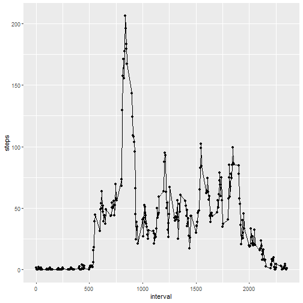

## Required Packages

```r
library(dplyr)
library(ggplot2)
library(knitr)
```

## Loading and preprocessing the data
#### 1. Load the data
* Firstly unzip activity file. Now the data is in csv (comma separated) file named activity.csv.
* Read the data into a data frame using read.csv function in R.

```r
unzip("activity.zip")
data <- read.csv('activity.csv')
summary(data)
```

```
##      steps                date          interval     
##  Min.   :  0.00   2012-10-01:  288   Min.   :   0.0  
##  1st Qu.:  0.00   2012-10-02:  288   1st Qu.: 588.8  
##  Median :  0.00   2012-10-03:  288   Median :1177.5  
##  Mean   : 37.38   2012-10-04:  288   Mean   :1177.5  
##  3rd Qu.: 12.00   2012-10-05:  288   3rd Qu.:1766.2  
##  Max.   :806.00   2012-10-06:  288   Max.   :2355.0  
##  NA's   :2304     (Other)   :15840
```

#### 2. Process/transform the data (if necessary) into a format suitable for your analysis
* Preprocess and convert the date into Date type since we need to plot timeseries plot later on in the assignment.

```r
data$date <- as.Date(data$date)
```

## What is mean total number of steps taken per day?
#### 1. Calculate the total number of steps taken per day
* Use filter, group_by and summarize in dplyr to group the date per day and caluclate the sum of steps for each day.

```r
StepsPerDay <- data %>% filter(!is.na(steps)) %>% group_by(date) %>% summarize(steps = sum(steps))
```

#### 2. If you do not understand the difference between a histogram and a barplot, research the difference between them. Make a histogram of the total number of steps taken each day

```r
hist(stepsByDay, breaks=100, xlab="Steps per day")
```


#### 3. Calculate and report the mean and median of the total number of steps taken per day

```r
mean(StepsPerDay$steps)
```

```
## [1] 10766.19
```

```r
median(StepsPerDay$steps)
```

```
## [1] 10765
```
Mean and median values are 10766.19 and 10765 respectively.

## What is the average daily activity pattern?
#### 1. Make a time series plot of the 5-minute interval (x-axis) and the average number of steps taken, averaged across all days (y-axis)

```r
AverageActivity <- data %>% filter(!is.na(steps)) %>% group_by(interval) %>% summarize(steps = mean(steps))
qplot(interval, steps, data=AverageActivity) + geom_point() + geom_line()
```



#### 2. Which 5-minute interval, on average across all the days in the dataset, contains the maximum number of steps?
* Compute the max value of "steps" in AverageActivity data.frame
* Identify the entry in data.frame corresponding to this max value and get its interval value.

```r
MaxSteps <- max(AverageActivity$steps)
AverageActivity[AverageActivity$steps == MaxSteps, ]$interval
```

```
## [1] 835
```

## Inputing missing values
#### 1. Calculate and report the total number of missing values in the dataset (i.e. the total number of rows with \color{red}{\verb|NA|}NAs)
* We can filter NA data with is.na() function in R
* Count the number of rows in the resulting data.frame to get the count of missing values.

```r
nrow(data[is.na(data), ])
```

```
## [1] 2304
```

#### 2. Devise a strategy for filling in all of the missing values in the dataset. The strategy does not need to be sophisticated. For example, you could use the mean/median for that day, or the mean for that 5-minute interval, etc.
Here is the simple strategy that can be used to fill in missing values.

* Get the mean for the 5-minute intervals
* Fill these values instead of NA in original data

#### 3. Create a new dataset that is equal to the original dataset but with the missing data filled in.

```r
nrow(data[is.na(data), ])
```

```
## [1] 2304
```

```r
newdata <- data
for (i in 1:nrow(data)) {
	if (is.na(newdata$steps[i])) {
		newdata$steps[i] <- AverageActivity[AverageActivity$interval == newdata$interval[i], ]$steps 
	}
}
```

#### 4. Make a histogram of the total number of steps taken each day and Calculate and report the mean and median total number of steps taken per day. Do these values differ from the estimates from the first part of the assignment? What is the impact of imputing missing data on the estimates of the total daily number of steps?

```r
StepsPerDay <- newdata %>% group_by(date) %>% summarize(steps = sum(steps))
hist(stepsByDay, breaks=100, xlab="Steps per day")
```


```r
mean(StepsPerDay$steps)
```

```
## [1] 10766.19
```

```r
median(StepsPerDay$steps)
```

```
## [1] 10766.19
```

## Are there differences in activity patterns between weekdays and weekends?
#### 1. Create a new factor variable in the dataset with two levels – “weekday” and “weekend” indicating whether a given date is a weekday or weekend day.
* Use weekdays() to get the day of the week (i.e., Monday, Tueday etc for example)
* If the resulting day is "Saturday" or "Sunday", consider the factor variable value as "weekend", otherwise "weekday"

```r
newdata$weekmode <- weekdays(newdata$date)
for (i in 1:nrow(newdata)) {
	if (newdata$weekmode[i] == "Saturday" || newdata$weekmode[i] == "Sunday") {
		newdata$weekmode[i] <- "weekend"
	} else {
		newdata$weekmode[i] <- "weekday"	
	}
}
```

#### 2. Make a panel plot containing a time series plot (i.e. \color{red}{\verb|type = "l"|}type="l") of the 5-minute interval (x-axis) and the average number of steps taken, averaged across all weekday days or weekend days (y-axis). See the README file in the GitHub repository to see an example of what this plot should look like using simulated data.
* Use ggplot and facets for panel plot.

```r
ActivityPattern <- aggregate(steps ~ interval + weekmode, newdata, mean, na.action = na.omit)

ggplot(ActivityPattern, aes(x=interval, y=steps)) + 
       geom_line(size=1) + 
       facet_wrap(~ weekmode, nrow=2, ncol=1) +
       labs(x="Interval", y="Number of steps") 
```


